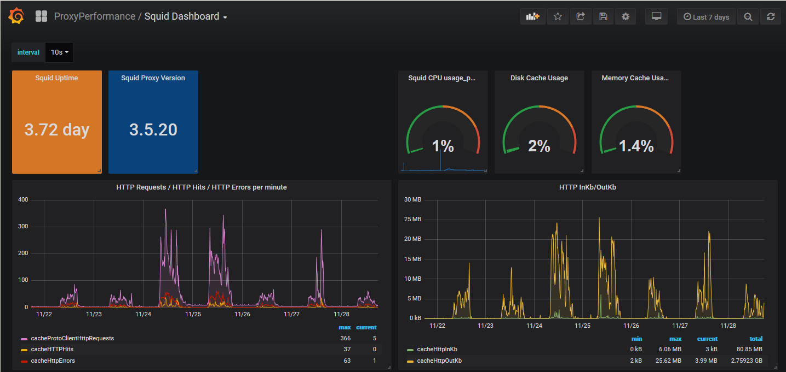
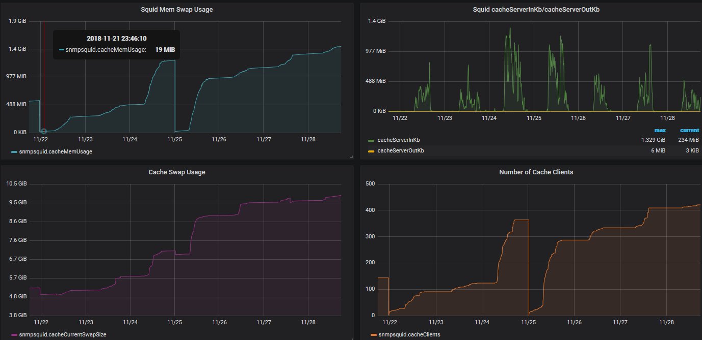

# Squid health monitoring via Telegraf Influxdb Grafana

Example Grafana dashboards






# Idea
Squid shares its ststistics via SNMP.
Metrics are scraped by another host using Telegraf SNMP feature. Telegraf saves metrics into InfluxDB.
Charts are presented in Grafana.


# Basic setup
1. Host with installed squid shares stats via built-in SNMP. Configuration:
    <p>a.) add content squid_host/etc/squid/squid.conf to your /etc/squid/squid.conf
    <p>b.) Open 3401 udp port from IP Address where Telegraf runs
    <p>c.) Modify line "acl snmpnet src YOUR_TELEGRAF_IP_ADDRESS" inside /etc/squid/squid.conf replacing string YOUR_TELEGRAF_IP_ADDRESS with valid hostname/IP.
    <p>d.) Restart Squid service e.g.
    ```bash
    systemctl restart squid
    ```

2. Telegraf host:
    <p>a.) Place telegraf_influxdb_host/etc/telegraf/telegraf.conf to /etc/telegraf/ (or add only section  [[inputs.snmp]] )
    <p>b.) Adjust line "agents = [ YOUR_SQUID_IP_ADDRESS:3401" ]" by setting valid hostname or IP of Squid address.
    <p>c.) Restart telegraf service e.g.
    ```bash
    systemctl restart telegraf
    ```

3. Grafana
    <p>1. Ensure InfluxD database named "telegraf" is set as a Data Source in Grafana Configuration
    <p>2. Import Squid_Dashboard_01.json into Grafana


# TODO
- add memory usage of all Squid processes to graphs

